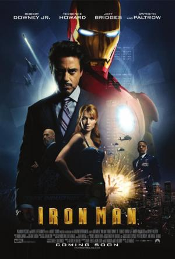

{: style="width:350px"}

- Titulo original: Iron Man

- Año: 2008

- Duración: 126 min.

- Pais: Estados Unidos

- Reparto: Robert Downey Jr., Terrence Howard, Gwyneth Paltrow, Jeff Bridges, Stan Lee, Leslie Bibb, Clark Gregg, Shaun Toub, Faran Tahir, Samuel L. Jackson, Bill Smitrovich, Sayed Badreya, Jon Favreau, Peter Billingsley, Tim Guinee, Tom Morello, Marco Khan, Kevin Foster, Eileen Weisinger, Ahmed Ahmed, Fahim Fazli, Gerard Sanders, Russell Richardson, Nazanin Boniadi, Stacy Stas, Donna Evans, Sahar Bibiyan, Patrick O'Connell, Adam Harrington, Meera Simhan, Ben Newmark, Ricki Lander, Jeannine Kaspar, Lana Kinnear, Masha Lund, Gabrielle Tuite, Tim Griffin, Joshua Harto, Micah Hauptman

- Sinposis:     El multimillonario fabricante de armas Tony Stark (Robert Downey Jr.) debe enfrentarse a su turbio pasado después de sufrir un accidente con una de sus armas. Equipado con una armadura de última generación tecnológica, se convierte en "El hombre de hierro", un héroe que se dedica a combatir el mal en todo el mundo
