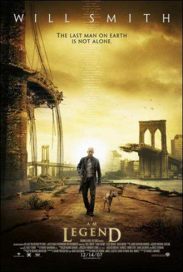

{: style="width:350px"}

- Titulo original: I Am Legend

- Año: 2007

- Duración: 100 min.

- Pais: Estados Unidos

- Reparto: Will Smith, Alice Braga, Salli Richardson-Whitfield, Paradox Pollack, Charlie Tahan, Darrell Foster, Emma Thompson, Courtney Munch, Willow Smith

- Sinposis:     Año 2012. Robert Neville (Will Smith) es el último hombre vivo que hay sobre la Tierra, pero no está solo. Los demás seres humanos se han convertido en vampiros y todos ansían beber su sangre. Durante el día vive en estado de alerta, como un cazador, y busca a los muertos vivientes mientras duermen; pero durante la noche debe esconderse de ellos y esperar el amanecer. Esta pesadilla empezó hace tres años: Neville era un brillante científico, pero no pudo impedir la expansión de un terrible virus creado por el hombre. Él ha sobrevivido porque es inmune al virus; todos los días envía mensajes por radio con la esperanza de que haya otros supervivientes, pero es inútil. Lo único que puede hacer es buscar una fórmula que le permita utilizar su sangre inmune para devolverles a los hombres su naturaleza. Pero está en inferioridad de condiciones y el tiempo se acaba. 
