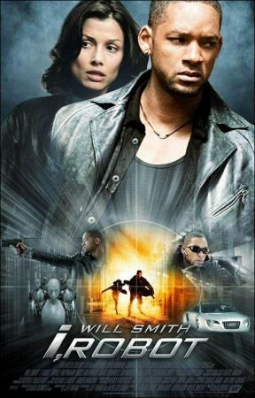

{: style="width:350px"}

- Titulo original: I, Robot

- Año: 2004

- Duración: 115 min.

- Pais: Estados Unidos

- Reparto: Will Smith, Bridget Moynahan, Bruce Greenwood, Chi McBride, Alan Tudyk, James Cromwell, Jerry Wasserman, Shia LaBeouf, Adrian Ricard, Fiona Hogan, Peter Shinkoda, Terry Chen, David Haysom, Scott Heind, Sharon Wilkins, Craig March, Kyanna Cox, Darren Moore, Aaron Douglas, Shayla Dyson, Bobby Stewart, Nicola Crosbie, Emily Tennant, Michael St. John Smith, Travis Webster, Roger Haskett, Tiffany Lyndall-Knight, Angela Moore, Ryan Zwick, Essra Vischon, Kenyan Lewis, Aaron Joseph, Simon Baker, Marrett Green

- Sinposis:    Chicago, año 2035. Vivimos en completa armonía con robots inteligentes. Cocinan para nosotros, conducen nuestros aviones, cuidan de nuestros hijos y confiamos plenamente en ellos debido a que se rigen por las Tres Leyes de la Robótica que nos protegen de cualquier daño. Inesperadamente un robot se ve implicado en el crimen de un brillante científico y el detective Del Spooner (Will Smith) queda a cargo de la investigación.
